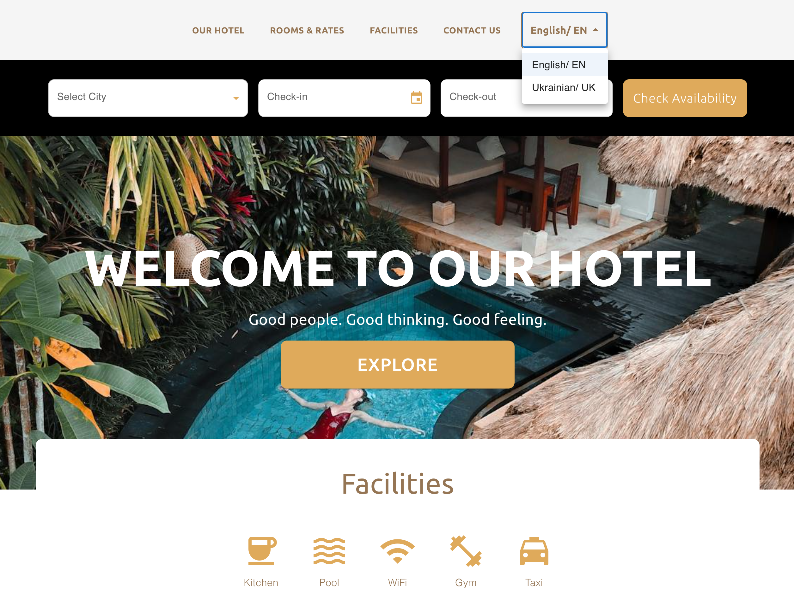
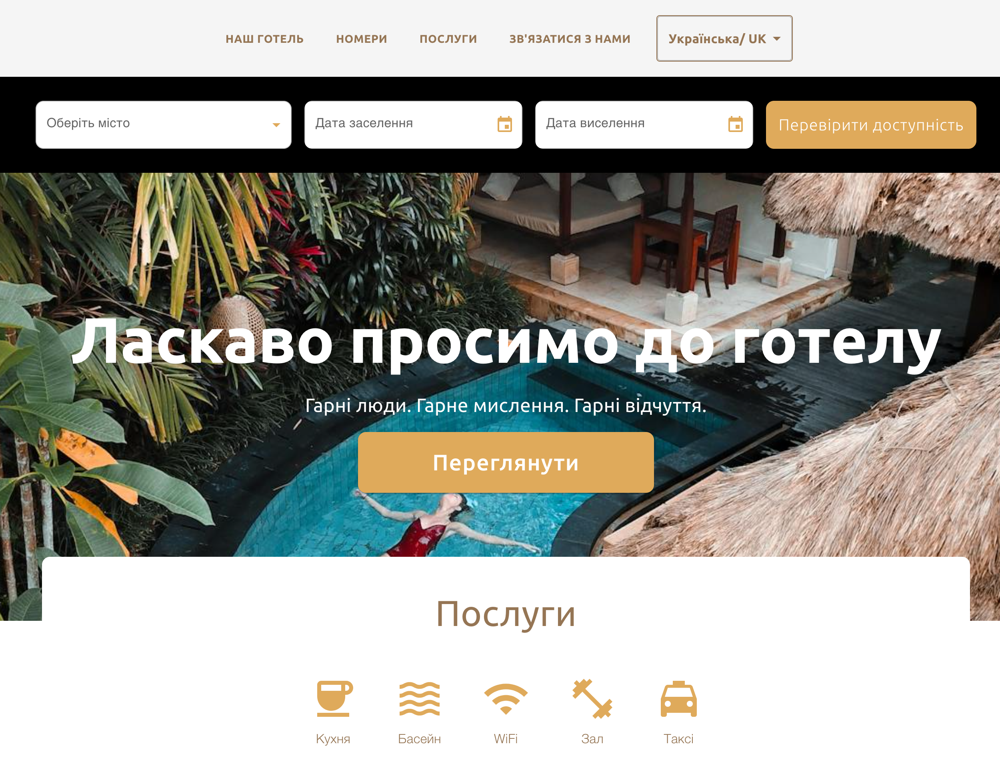

# <a href="https://" target="_blank"> Pixel-Perfect Hotel Landing Page (Jan 2025)</a>

This project is a pixel-perfect multi-language landing page brought to life from a Figma design using a powerful tech stack.

## Features

- **Modern Tech Stack**: Built with React, Next.js, Material-UI (MUI), i18n, and styled using CSS-in-JS.
- **Multi-language Support**: Toggle easily between English and Ukrainian.
- **Pixel-Perfect Design**: Matches the original Figma layout to the smallest detail.
- **Responsive Layout**: Looks and works great on any device.
- **Interactive Components**: Includes a date picker, room grid, and clear call-to-action buttons.
- **Open Source Images**: All visuals come from free and open sources.

## Screenshots

Here are some visuals of the project layout and functionality:

  

    
  

  

    
    
  

## Tech Stack

- **React**: For building the user interface.
- **Next.js**: To handle server-side rendering and routing.
- **Material-UI (MUI)**: For consistent and modern design components.
- **i18n**: For implementing multi-language support.

## How to Run

1. Clone the repository.
2. Navigate to the project directory.
3. Run `npm install` to install the required dependencies.
4. Start the development server with `npm run dev`.
5. Open `http://localhost:3000` in your browser to view the landing page.

## Author

[Olexandra Kunytska](https://github.com/olexandracodes) - Frontend Developer
